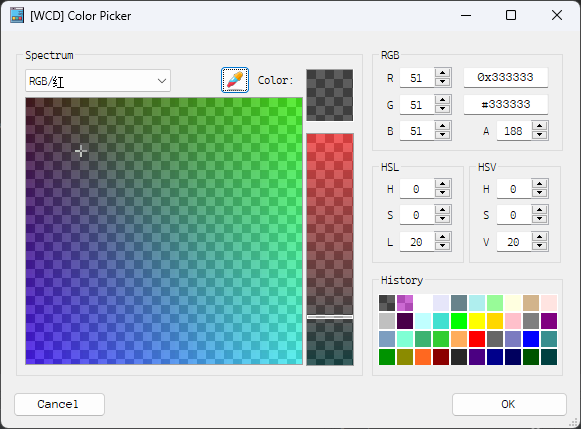
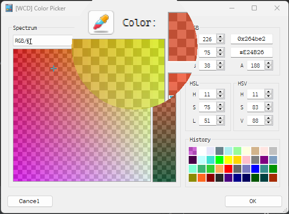

# WTools
Misc Windows Tools

## [WCD] Color Picker
First Release [1.0](https://github.com/wcdnail/wtools/releases/tag/WCPKR-1.0)




## Build
MSVC solution files.
CMake will be provided later.

### Build deps
- WTL
- WIL

### Build prepare
Clone VCPKG
CD "VCPKG"

Win CMD:
```cmd
setx VCPKG_ROOT=%CD%
call bootstrap-vcpkg.bat -disableMetrics
vcpkg install wtl wil
```

## Thanks to
- [VCPKG team](https://github.com/microsoft/vcpkg)
- [WTL team](https://sourceforge.net/projects/wtl/)
- [Franco Tortoriello et al.](https://gitlab.com/ftortoriello)
- [Tim Smith CColorButton](https://www.codeproject.com/Articles/2430/Color-Picker-for-WTL-with-XP-themes)
- [Matthias C. M. Troffaes mcmtroffaes inipp](https://github.com/mcmtroffaes/inipp)
- [Meacz's ChooseColor](https://github.com/meacz/ChooseColor.git)
- [David Swigger's Photoshop's-like color pickers](https://www.codeproject.com/Articles/2577/Xguiplus-A-set-of-Photoshop-s-like-color-pickers)
- [Jake Besworth's Simple Color Conversions](https://github.com/jakebesworth/Simple-Color-Conversions/blob/master/color.c)
